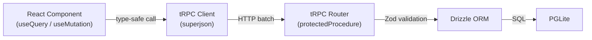

## Overview

FinOpenPOS uses **tRPC v11** for end-to-end type-safe API communication. All procedures require authentication via Better Auth session cookie.



## Interactive Docs

Visit **`/api/docs`** for the full interactive API reference powered by **Scalar**, auto-generated from the tRPC router definitions.

The raw OpenAPI 3.0 spec is available at `/api/openapi.json`.

## tRPC Procedures

| Router | Procedures | Description |
|--------|-----------|-------------|
| `products` | `list`, `create`, `update`, `delete` | Product CRUD with stock and categories |
| `customers` | `list`, `create`, `update`, `delete` | Customer CRUD with status |
| `orders` | `list`, `create`, `update`, `delete` | Order management with items and transactions |
| `transactions` | `list`, `create`, `update`, `delete` | Income/expense transaction logging |
| `paymentMethods` | `list`, `create`, `update`, `delete` | Payment method management |
| `dashboard` | `stats` | Aggregated revenue, expenses, profit, cash flow, margins |
| `fiscal` | `list`, `getById`, `issue`, `cancel`, `void`, `sync` | Invoice management |
| `fiscalSettings` | `get`, `upsert`, `testConnection`, `getCertificateInfo` | Fiscal configuration |
| `cities` | `listByState` | IBGE city lookup for fiscal address |

## Authentication

All procedures use `protectedProcedure` which:

1. Extracts the session cookie from the request
2. Validates it with Better Auth
3. Injects `ctx.user` (with `uid`) into the procedure context
4. Filters all queries by `user_uid` for multi-tenancy

Unauthenticated requests receive a `401 Unauthorized` response.

## Usage in React

```tsx
// Type-safe query — TypeScript infers the return type
const { data: products } = trpc.products.list.useQuery();

// Type-safe mutation — input is validated by Zod
const createProduct = trpc.products.create.useMutation();
await createProduct.mutateAsync({
  name: "Widget",
  price: 1999, // R$19.99 in cents
  in_stock: 50,
  category: "Electronics",
});
```
