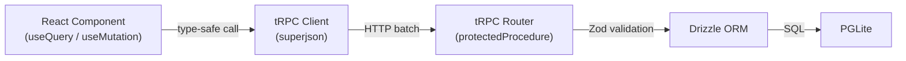

## Visão Geral

O FinOpenPOS usa **tRPC v11** para comunicação de API type-safe de ponta a ponta. Todos os procedures requerem autenticação via cookie de sessão do Better Auth.



## Documentação Interativa

Acesse **`/api/docs`** para a referência completa e interativa da API, alimentada pelo **Scalar**, gerada automaticamente a partir das definições dos routers tRPC.

A spec OpenAPI 3.0 bruta está disponível em `/api/openapi.json`.

## Procedures tRPC

| Router | Procedures | Descrição |
|--------|-----------|-----------|
| `products` | `list`, `create`, `update`, `delete` | CRUD de produtos com estoque e categorias |
| `customers` | `list`, `create`, `update`, `delete` | CRUD de clientes com status |
| `orders` | `list`, `create`, `update`, `delete` | Gestão de pedidos com itens e transações |
| `transactions` | `list`, `create`, `update`, `delete` | Registro de transações de receita/despesa |
| `paymentMethods` | `list`, `create`, `update`, `delete` | Gestão de métodos de pagamento |
| `dashboard` | `stats` | Receita, despesas, lucro, fluxo de caixa e margens agregados |
| `fiscal` | `list`, `getById`, `issue`, `cancel`, `void`, `sync` | Gestão de notas fiscais |
| `fiscalSettings` | `get`, `upsert`, `testConnection`, `getCertificateInfo` | Configuração fiscal |
| `cities` | `listByState` | Consulta de cidades IBGE para endereço fiscal |

## Autenticação

Todos os procedures usam `protectedProcedure` que:

1. Extrai o cookie de sessão da requisição
2. Valida com o Better Auth
3. Injeta `ctx.user` (com `uid`) no contexto do procedure
4. Filtra todas as queries por `user_uid` para multi-tenancy

Requisições não autenticadas recebem uma resposta `401 Unauthorized`.

## Uso no React

```tsx
// Query type-safe — TypeScript infere o tipo de retorno
const { data: products } = trpc.products.list.useQuery();

// Mutation type-safe — input é validado pelo Zod
const createProduct = trpc.products.create.useMutation();
await createProduct.mutateAsync({
  name: "Widget",
  price: 1999, // R$19,99 em centavos
  in_stock: 50,
  category: "Electronics",
});
```
