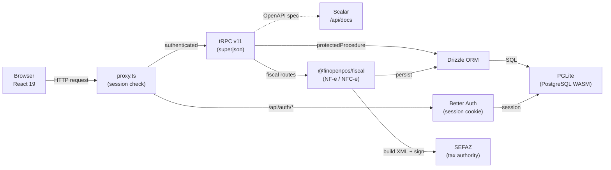

## Overview

FinOpenPOS follows a layered architecture with clear boundaries between the browser, API, authentication, database and fiscal modules.

## Request Flow

1. **Browser** sends an HTTP request
2. **proxy.ts** (Next.js 16 proxy, replaces `middleware.ts`) checks for a valid session cookie
3. Authenticated requests are routed to **tRPC v11** procedures
4. Auth requests (`/api/auth/*`) are handled by **Better Auth**
5. tRPC procedures use **Drizzle ORM** for database access and **@finopenpos/fiscal** for fiscal operations
6. The fiscal module builds XML, signs it with the A1 certificate, and communicates with **SEFAZ** via mTLS (curl)
7. All data is stored in **PGLite** (PostgreSQL via WASM) — no external database required

## Multi-Tenancy

All business and fiscal tables include a `user_uid` column. Every query filters by the authenticated user's UID, ensuring complete data isolation between tenants.

## Key Design Decisions

| Decision | Rationale |
|----------|-----------|
| PGLite over PostgreSQL | Zero config, no external dependencies, ideal for dev and small deployments |
| proxy.ts over middleware.ts | Next.js 16 replaced middleware with a proxy module |
| tRPC over REST | End-to-end type safety, no code generation needed |
| curl over node:https | Bun's `node:https` Agent doesn't support PFX for mTLS |
| openssl over native PKCS#12 | Bun can't handle native PKCS#12 parsing (RC2-40 cipher) |
| Standalone fiscal package | `@finopenpos/fiscal` has zero database deps, reusable in any TS project |
| Integer cents for money | Avoids floating-point precision issues (`4999` = R$49.99) |
