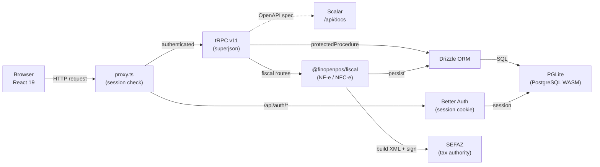

## Visão Geral

O FinOpenPOS segue uma arquitetura em camadas com limites claros entre o navegador, API, autenticação, banco de dados e módulos fiscais.

## Fluxo de Requisições

1. O **Navegador** envia uma requisição HTTP
2. O **proxy.ts** (proxy do Next.js 16, substitui o `middleware.ts`) verifica se há um cookie de sessão válido
3. Requisições autenticadas são roteadas para os procedures do **tRPC v11**
4. Requisições de autenticação (`/api/auth/*`) são tratadas pelo **Better Auth**
5. Os procedures do tRPC usam o **Drizzle ORM** para acesso ao banco de dados e o **@finopenpos/fiscal** para operações fiscais
6. O módulo fiscal constrói o XML, assina com o certificado A1 e se comunica com o **SEFAZ** via mTLS (curl)
7. Todos os dados são armazenados no **PGLite** (PostgreSQL via WASM) — nenhum banco de dados externo necessário

## Multi-Tenancy

Todas as tabelas de negócio e fiscais incluem uma coluna `user_uid`. Toda consulta filtra pelo UID do usuário autenticado, garantindo isolamento completo dos dados entre tenants.

## Decisões de Design Importantes

| Decisão | Justificativa |
|---------|---------------|
| PGLite ao invés de PostgreSQL | Zero configuração, sem dependências externas, ideal para dev e implantações pequenas |
| proxy.ts ao invés de middleware.ts | Next.js 16 substituiu o middleware por um módulo proxy |
| tRPC ao invés de REST | Tipagem segura de ponta a ponta, sem necessidade de geração de código |
| curl ao invés de node:https | O `node:https` Agent do Bun não suporta PFX para mTLS |
| openssl ao invés de PKCS#12 nativo | Bun não consegue fazer parsing nativo de PKCS#12 (cifra RC2-40) |
| Pacote fiscal independente | `@finopenpos/fiscal` não tem dependência de banco de dados, reutilizável em qualquer projeto TS |
| Centavos inteiros para dinheiro | Evita problemas de precisão de ponto flutuante (`4999` = R$49,99) |
