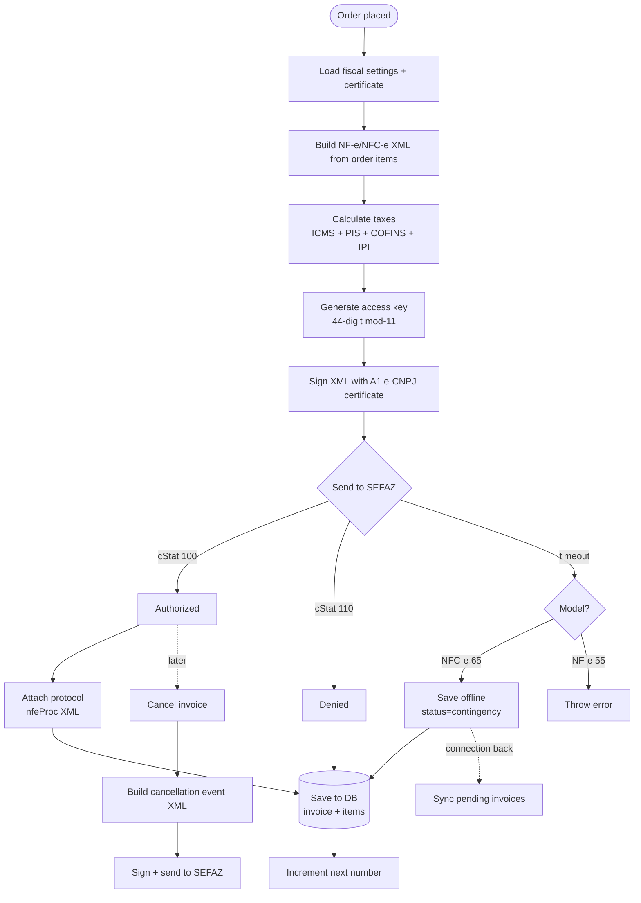
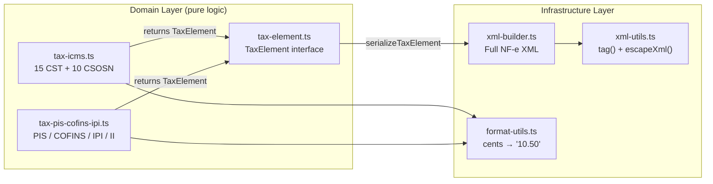
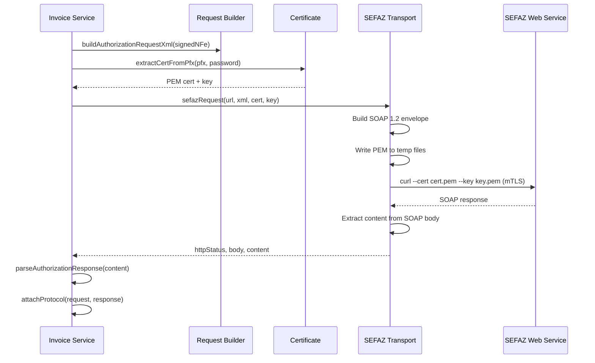

## What is @finopenpos/fiscal?

The fiscal module lives in `packages/fiscal/` as **@finopenpos/fiscal** — a standalone package with zero database dependencies. It can be used independently in any TypeScript/JavaScript project.

It implements complete Brazilian electronic invoicing following the **SEFAZ MOC 4.00** specification, ported from the PHP [sped-nfe](https://github.com/nfephp-org/sped-nfe) library to TypeScript with DDD architecture.

## Capabilities

- **NF-e** (model 55) — B2B invoices
- **NFC-e** (model 65) — consumer invoices
- **Tax engine** — ICMS (15 CST + 10 CSOSN), PIS, COFINS, IPI, II, ISSQN
- **XML generation** — complete NF-e/NFC-e XML per MOC 4.00
- **Digital signature** — XML signing with A1 e-CNPJ (PFX/PKCS#12)
- **SEFAZ communication** — authorize, cancel, void, query (mTLS via curl)
- **QR code** — NFC-e QR code v2.00/v3.00 (online + offline)
- **Contingency** — SVC-AN, SVC-RS, EPEC offline modes
- **IBS/CBS reform events** — 14 event types for Brazilian tax reform
- **TXT conversion** — legacy SPED format (4 layouts)
- **754 tests** — ported from PHP sped-nfe test suite

## Invoice Lifecycle

## Tax Engine

Tax modules never import XML code — they return `TaxElement` structures that the builder serializes. This keeps domain logic pure and testable.

## SEFAZ Communication

> **Why curl?** Bun's `node:https` Agent does not support PFX for mTLS. The workaround extracts PEM from PFX via openssl and uses curl for the HTTPS request.

## Detailed Documentation

| Page | Topic |
|------|-------|
| [Architecture](/docs/fiscal/architecture) | DDD layers, dependency graph, numeric conventions |
| [Invoice Workflow](/docs/fiscal/invoice-workflow) | Service lifecycle, repositories, multi-tenancy |
| [Tax Engine](/docs/fiscal/tax-engine) | ICMS/PIS/COFINS/IPI, TaxElement pattern |
| [XML Generation](/docs/fiscal/xml-generation) | xml-builder, complement, NF-e XML structure |
| [SEFAZ Communication](/docs/fiscal/sefaz-communication) | Transport, URLs, request builders, reform events |
| [Certificate & Signing](/docs/fiscal/certificate-signing) | PFX extraction, XML digital signature |
| [Value Objects](/docs/fiscal/value-objects) | AccessKey (mod-11), TaxId (CPF/CNPJ) |
| [Contingency](/docs/fiscal/contingency) | SVC-AN/SVC-RS, EPEC, offline modes |
| [QR Code](/docs/fiscal/qrcode) | NFC-e QR code v2.00/v3.00 |
| [TXT Conversion](/docs/fiscal/txt-conversion) | SPED TXT legacy format conversion |
| [Database Schema](/docs/fiscal/database-schema) | Fiscal tables, multi-tenancy |
| [Utilities](/docs/fiscal/utilities) | GTIN, CEP lookup, state codes |
| [Emission Testing](/docs/fiscal/emission-testing) | SEFAZ PR real-world testing notes |
