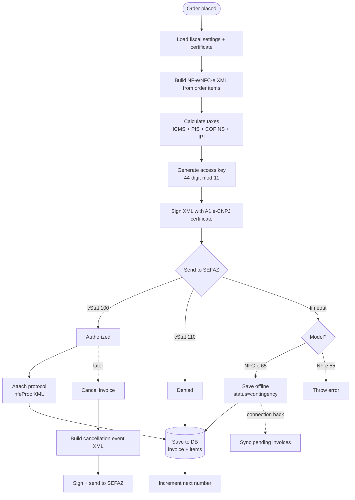
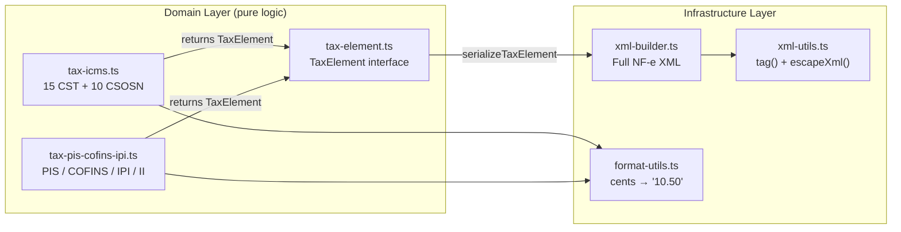
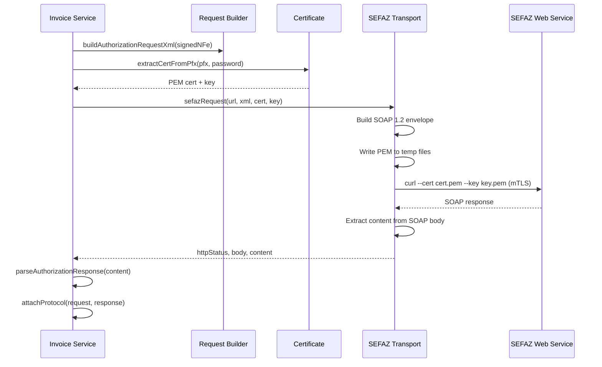

## O que e o @finopenpos/fiscal?

O modulo fiscal esta em `packages/fiscal/` como **@finopenpos/fiscal** — um pacote independente sem dependencias de banco de dados. Ele pode ser usado de forma independente em qualquer projeto TypeScript/JavaScript.

Implementa a emissao completa de documentos fiscais eletronicos brasileiros seguindo a especificacao **SEFAZ MOC 4.00**, portado da biblioteca PHP [sped-nfe](https://github.com/nfephp-org/sped-nfe) para TypeScript com arquitetura DDD.

## Funcionalidades

- **NF-e** (modelo 55) — notas fiscais B2B
- **NFC-e** (modelo 65) — notas fiscais ao consumidor
- **Motor de impostos** — ICMS (15 CST + 10 CSOSN), PIS, COFINS, IPI, II, ISSQN
- **Geracao de XML** — XML completo de NF-e/NFC-e conforme MOC 4.00
- **Assinatura digital** — assinatura de XML com e-CNPJ A1 (PFX/PKCS#12)
- **Comunicacao SEFAZ** — autorizar, cancelar, inutilizar, consultar (mTLS via curl)
- **QR code** — QR code de NFC-e v2.00/v3.00 (online + offline)
- **Contingencia** — SVC-AN, SVC-RS, EPEC modos offline
- **Eventos da reforma IBS/CBS** — 14 tipos de evento para a reforma tributaria brasileira
- **Conversao TXT** — formato legado SPED (4 layouts)
- **754 testes** — portados da suite de testes PHP sped-nfe

## Ciclo de Vida da Nota Fiscal

## Motor de Impostos

Os modulos de impostos nunca importam codigo XML — eles retornam estruturas `TaxElement` que o builder serializa. Isso mantem a logica de dominio pura e testavel.

## Comunicacao SEFAZ

> **Por que curl?** O `node:https` Agent do Bun nao suporta PFX para mTLS. A solucao alternativa extrai PEM do PFX via openssl e usa curl para a requisicao HTTPS.

## Documentacao Detalhada

| Pagina | Topico |
|--------|--------|
| [Arquitetura](/docs/fiscal/architecture) | Camadas DDD, grafo de dependencias, convencoes numericas |
| [Fluxo da Nota Fiscal](/docs/fiscal/invoice-workflow) | Ciclo de vida do servico, repositorios, multi-tenancy |
| [Motor de Impostos](/docs/fiscal/tax-engine) | ICMS/PIS/COFINS/IPI, padrao TaxElement |
| [Geracao de XML](/docs/fiscal/xml-generation) | xml-builder, complemento, estrutura XML da NF-e |
| [Comunicacao SEFAZ](/docs/fiscal/sefaz-communication) | Transporte, URLs, construtores de requisicao, eventos da reforma |
| [Certificado e Assinatura](/docs/fiscal/certificate-signing) | Extracao PFX, assinatura digital XML |
| [Value Objects](/docs/fiscal/value-objects) | AccessKey (mod-11), TaxId (CPF/CNPJ) |
| [Contingencia](/docs/fiscal/contingency) | SVC-AN/SVC-RS, EPEC, modos offline |
| [QR Code](/docs/fiscal/qrcode) | QR code NFC-e v2.00/v3.00 |
| [Conversao TXT](/docs/fiscal/txt-conversion) | Conversao de formato legado SPED TXT |
| [Schema do Banco de Dados](/docs/fiscal/database-schema) | Tabelas fiscais, multi-tenancy |
| [Utilitarios](/docs/fiscal/utilities) | GTIN, consulta CEP, codigos de estado |
| [Testes de Emissao](/docs/fiscal/emission-testing) | Notas sobre testes reais com SEFAZ PR |
