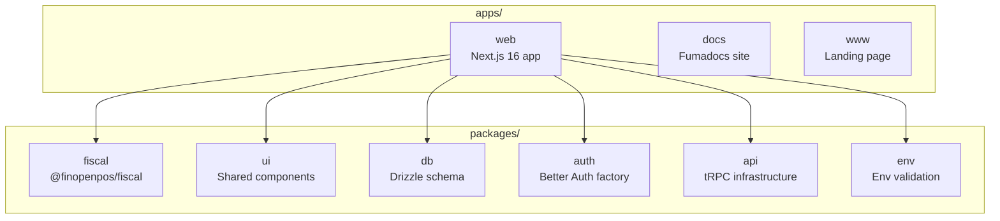

## Monorepo Overview

FinOpenPOS is organized as a **Turborepo** monorepo with apps and shared packages.



## Directory Layout

```
FinOpenPOS/
├── apps/
│   ├── web/                        # Next.js 16 web application
│   │   ├── src/
│   │   │   ├── app/                # Pages (admin, login, signup, API routes)
│   │   │   ├── components/         # UI components (shadcn + custom)
│   │   │   ├── lib/
│   │   │   │   ├── db/             # Drizzle schema + PGLite singleton
│   │   │   │   ├── invoice-service.ts      # Invoice lifecycle orchestrator
│   │   │   │   ├── invoice-repository.ts   # Invoice persistence (Drizzle)
│   │   │   │   ├── fiscal-settings-repository.ts
│   │   │   │   └── trpc/           # tRPC routers (business + fiscal)
│   │   │   ├── messages/           # i18n (en.ts, pt-BR.ts)
│   │   │   └── proxy.ts            # Next.js 16 middleware
│   │   ├── scripts/                # DB ensure, ER gen, prepare-prod
│   │   └── data/                   # PGLite database (gitignored)
│   ├── docs/                       # This documentation site (Fumadocs)
│   └── www/                        # Landing page
├── packages/
│   └── fiscal/                     # @finopenpos/fiscal — standalone
│       └── src/
│           ├── __tests__/          # 754 tests (ported from PHP sped-nfe)
│           ├── value-objects/       # AccessKey, TaxId
│           ├── tax-icms.ts         # ICMS tax engine (25 variants)
│           ├── tax-pis-cofins-ipi.ts
│           ├── xml-builder.ts      # NF-e XML generation
│           ├── certificate.ts      # PFX extraction + XML signing
│           ├── sefaz-*.ts          # SEFAZ communication layer
│           └── ...                 # 30+ modules
├── turbo.json                      # Turborepo task config
├── biome.json                      # Linter/formatter config
├── Dockerfile                      # Dev (PGLite) Docker image
├── Dockerfile.production           # Production (PostgreSQL) Docker image
└── compose.yaml                    # Docker Compose
```

## Package Descriptions

| Package | Name | Description |
|---------|------|-------------|
| `apps/web` | — | Main Next.js 16 application with POS, dashboard, and fiscal UI |
| `apps/docs` | — | Documentation site built with Fumadocs |
| `apps/www` | — | Landing page |
| `packages/fiscal` | `@finopenpos/fiscal` | Standalone Brazilian fiscal library (NF-e/NFC-e), zero database deps |
| `packages/ui` | `@finopenpos/ui` | Shared UI components (shadcn/Radix-based) |
| `packages/db` | `@finopenpos/db` | Drizzle ORM schema and database configuration |
| `packages/auth` | `@finopenpos/auth` | Better Auth factory and configuration |
| `packages/api` | `@finopenpos/api` | tRPC router infrastructure |
| `packages/env` | `@finopenpos/env` | Environment variable validation (t3-oss/env) |

## Turborepo Tasks

The `turbo.json` configures task dependencies and caching:

- `dev` — runs all apps in parallel
- `build` — builds all apps (respects dependencies)
- `check` — runs Biome lint + format across the monorepo
- `test` — runs tests per package
