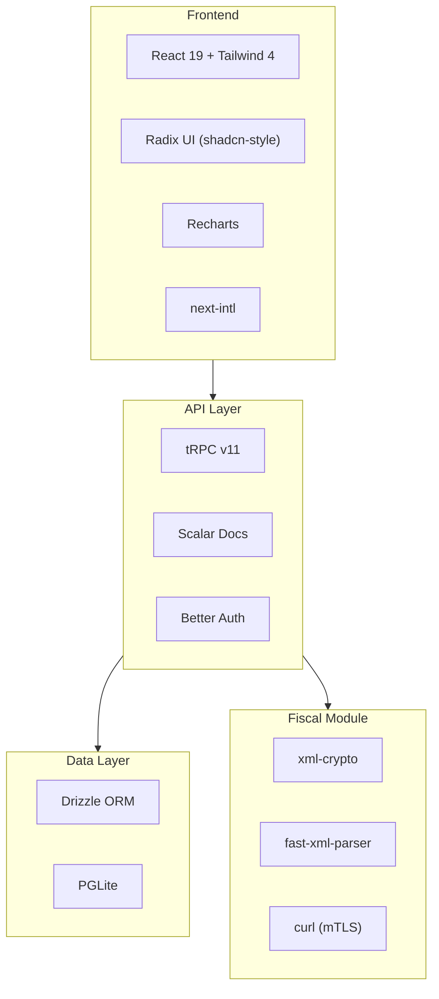

## Stack Overview

| Layer | Technology | Purpose |
|-------|------------|---------|
| Framework | **Next.js 16** (App Router) | Server-side rendering, API routes, proxy |
| UI | **React 19**, Tailwind CSS 4, Radix UI | Component library and styling |
| Charts | **Recharts** | Dashboard interactive charts |
| Database | **PGLite** (PostgreSQL via WASM) | Embedded PostgreSQL, zero config |
| ORM | **Drizzle ORM** | Type-safe SQL queries and schema management |
| API | **tRPC v11** (superjson) | End-to-end type-safe API layer |
| Auth | **Better Auth** | Email/password authentication with session cookies |
| API Docs | **Scalar** (OpenAPI 3.0) | Interactive API documentation at `/api/docs` |
| XML Signing | **xml-crypto** | NF-e/NFC-e digital signature (RSA-SHA1) |
| XML Parsing | **fast-xml-parser** | SEFAZ response parsing |
| Runtime | **Bun** | Package manager, test runner, dev server |
| i18n | **next-intl** | Internationalization (en + pt-BR), cookie-based |
| Monorepo | **Turborepo** | Task orchestration, caching, parallel builds |
| Linter | **Biome** | Linting and formatting |
| Fiscal | **@finopenpos/fiscal** | Standalone Brazilian fiscal module |

## Architecture Layers

## Why These Choices?

### PGLite
Full PostgreSQL running as WASM inside the Node.js process. No need to install, configure or run a separate database server. Data is stored on the filesystem at `apps/web/data/pglite`. For production, you can [migrate to real PostgreSQL](/docs/database#migrating-to-postgresql) without changing any queries.

### tRPC v11
Provides end-to-end type safety from the database schema to the React components. No code generation, no API spec maintenance — change a procedure and TypeScript catches all consumers.

### Better Auth
Simple email/password authentication with session cookies. Uses Drizzle adapter for storing sessions and users in the same PGLite database.

### Bun
Used as the package manager (`bun install`), test runner (`bun test`), and dev server. Significantly faster than npm/yarn for installs and script execution.

### next-intl
Cookie-based internationalization (no URL routing). Supports English and Brazilian Portuguese. Message files are `.ts` (not `.json`) for HMR support during development.
