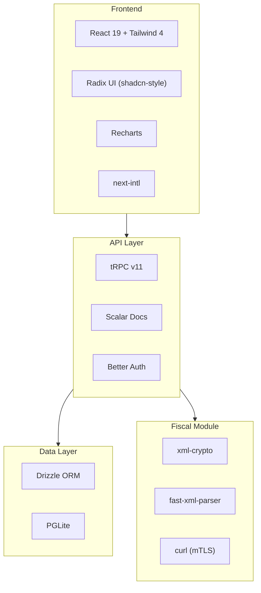

## Visão Geral da Stack

| Camada | Tecnologia | Finalidade |
|--------|------------|------------|
| Framework | **Next.js 16** (App Router) | Renderização server-side, rotas de API, proxy |
| UI | **React 19**, Tailwind CSS 4, Radix UI | Biblioteca de componentes e estilização |
| Gráficos | **Recharts** | Gráficos interativos do dashboard |
| Banco de Dados | **PGLite** (PostgreSQL via WASM) | PostgreSQL embarcado, zero configuração |
| ORM | **Drizzle ORM** | Queries SQL type-safe e gerenciamento de schema |
| API | **tRPC v11** (superjson) | Camada de API type-safe de ponta a ponta |
| Autenticação | **Better Auth** | Autenticação email/senha com cookies de sessão |
| Docs da API | **Scalar** (OpenAPI 3.0) | Documentação interativa da API em `/api/docs` |
| Assinatura XML | **xml-crypto** | Assinatura digital NF-e/NFC-e (RSA-SHA1) |
| Parsing XML | **fast-xml-parser** | Parsing de respostas do SEFAZ |
| Runtime | **Bun** | Gerenciador de pacotes, executor de testes, servidor dev |
| i18n | **next-intl** | Internacionalização (en + pt-BR), baseada em cookie |
| Monorepo | **Turborepo** | Orquestração de tarefas, cache, builds paralelos |
| Linter | **Biome** | Linting e formatação |
| Fiscal | **@finopenpos/fiscal** | Módulo fiscal brasileiro independente |

## Camadas da Arquitetura

## Por Que Essas Escolhas?

### PGLite
PostgreSQL completo rodando como WASM dentro do processo Node.js. Não é necessário instalar, configurar ou executar um servidor de banco de dados separado. Os dados são armazenados no sistema de arquivos em `apps/web/data/pglite`. Para produção, você pode [migrar para PostgreSQL real](/docs/database#migrating-to-postgresql) sem alterar nenhuma query.

### tRPC v11
Fornece tipagem segura de ponta a ponta, do schema do banco de dados até os componentes React. Sem geração de código, sem manutenção de spec de API — altere um procedure e o TypeScript captura todos os consumidores.

### Better Auth
Autenticação simples com email/senha usando cookies de sessão. Usa o adaptador Drizzle para armazenar sessões e usuários no mesmo banco PGLite.

### Bun
Usado como gerenciador de pacotes (`bun install`), executor de testes (`bun test`) e servidor de desenvolvimento. Significativamente mais rápido que npm/yarn para instalações e execução de scripts.

### next-intl
Internacionalização baseada em cookie (sem roteamento por URL). Suporta Inglês e Português Brasileiro. Os arquivos de mensagens são `.ts` (não `.json`) para suporte a HMR durante o desenvolvimento.
