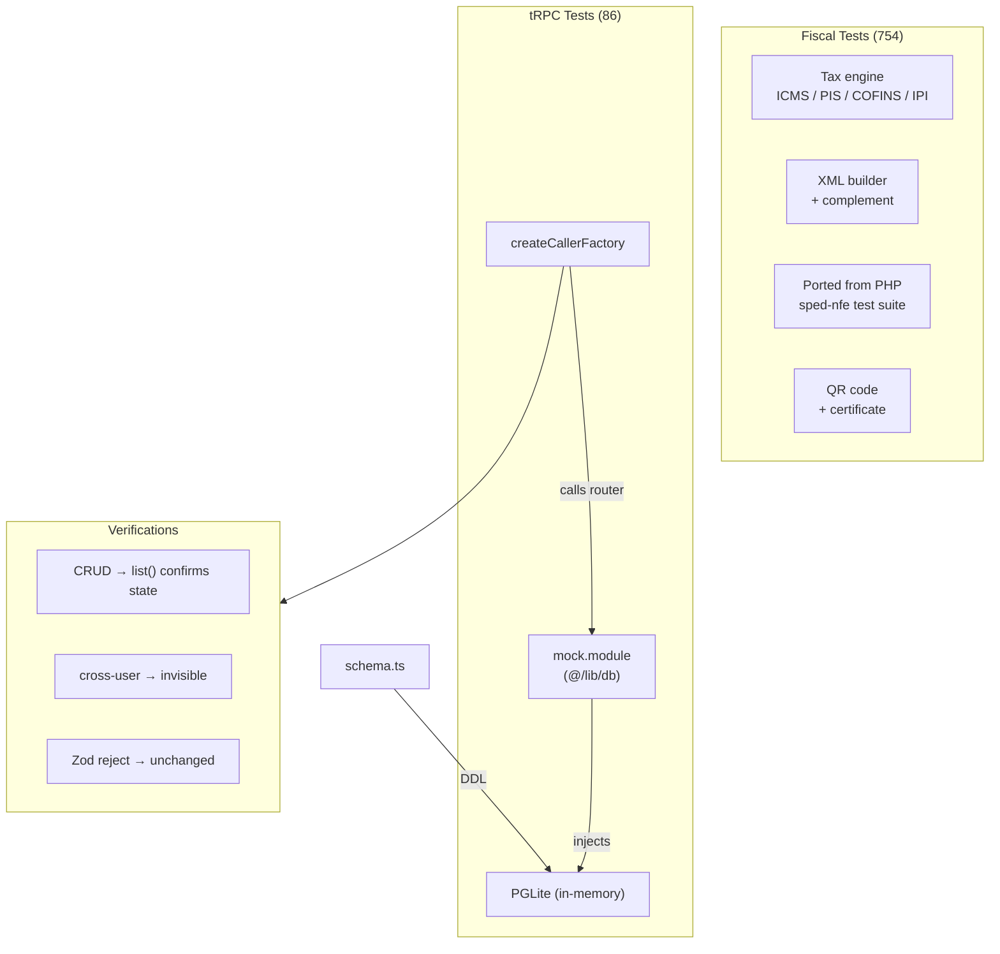

## Overview

840 tests across 2 test suites, all passing with 0 failures.

| Suite | Tests | Location | Runner |
|-------|-------|----------|--------|
| Fiscal | 754 | `packages/fiscal/` | `bun test` |
| tRPC | 86 | `apps/web/` | `bun test` |

<Callout type="warn">
Run fiscal and tRPC tests **separately** — Bun can segfault on large parallel runs.
</Callout>

## Running Tests

```bash
# tRPC router tests
cd apps/web && bun test

# Fiscal module tests
cd packages/fiscal && bun test

# Coverage report
cd apps/web && bun run test:coverage
```

## Test Architecture



## Fiscal Tests

The fiscal test suite (754 tests) covers:

- **Tax calculations** — all 15 ICMS CST + 10 CSOSN variants, PIS, COFINS, IPI, II
- **XML generation** — complete NF-e/NFC-e XML structure validation
- **XML complement** — protocol attachment, digest verification
- **QR code** — v2.00/v3.00 generation (online + offline)
- **Certificate** — PFX extraction, XML digital signature
- **Value objects** — AccessKey (mod-11), TaxId (CPF/CNPJ)
- **Utilities** — GTIN validation, state codes, standardization
- **TXT conversion** — 4 legacy SPED layouts

Tests were ported from the PHP [sped-nfe](https://github.com/nfephp-org/sped-nfe) library, ensuring feature parity.

## tRPC Tests

The tRPC test suite (86 tests) uses **PGLite in-memory** for isolation:

1. A `mock.module` overrides `@/lib/db` with an in-memory PGLite instance
2. `createCallerFactory` creates a direct procedure caller (no HTTP)
3. Each test verifies CRUD operations, multi-tenant isolation (`user_uid`), and Zod input validation
