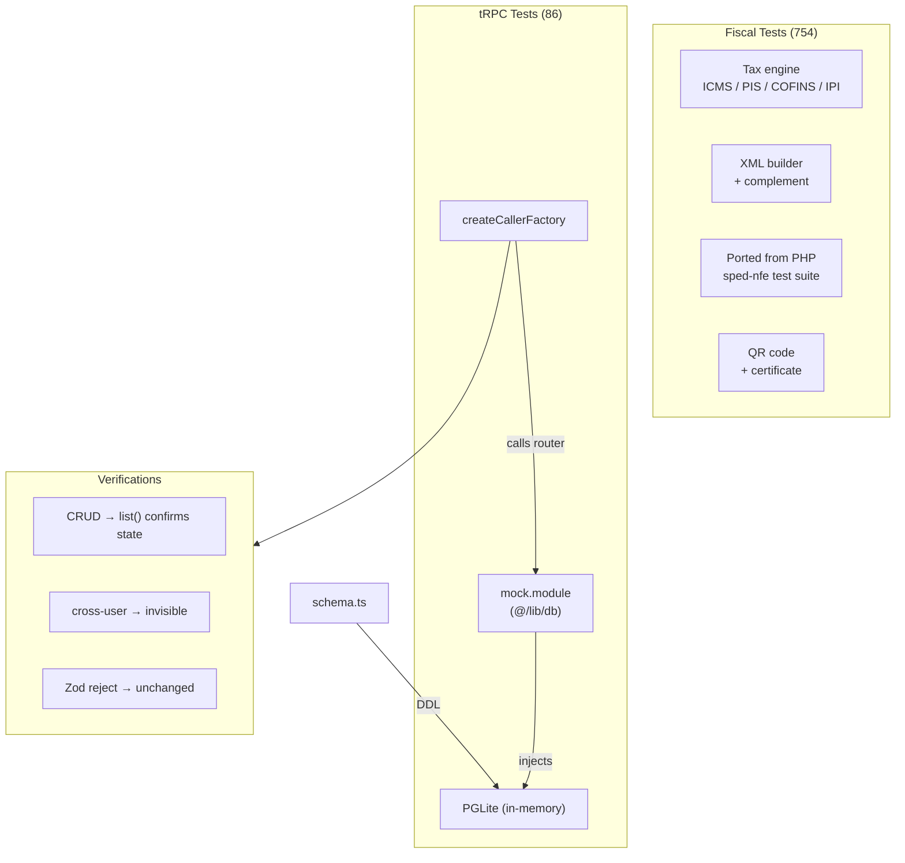

## Visão Geral

840 testes em 2 suítes de teste, todos passando com 0 falhas.

| Suíte | Testes | Localização | Executor |
|-------|--------|-------------|----------|
| Fiscal | 754 | `packages/fiscal/` | `bun test` |
| tRPC | 86 | `apps/web/` | `bun test` |

<Callout type="warn">
Execute os testes fiscal e tRPC **separadamente** — o Bun pode sofrer segfault em execuções paralelas grandes.
</Callout>

## Executando os Testes

```bash
# Testes dos routers tRPC
cd apps/web && bun test

# Testes do módulo fiscal
cd packages/fiscal && bun test

# Relatório de cobertura
cd apps/web && bun run test:coverage
```

## Arquitetura de Testes



## Testes Fiscais

A suíte de testes fiscais (754 testes) cobre:

- **Cálculos tributários** — todos os 15 CST ICMS + 10 variantes CSOSN, PIS, COFINS, IPI, II
- **Geração de XML** — validação completa da estrutura XML NF-e/NFC-e
- **Complemento XML** — anexação de protocolo, verificação de digest
- **QR code** — geração v2.00/v3.00 (online + offline)
- **Certificado** — extração PFX, assinatura digital XML
- **Value objects** — AccessKey (mod-11), TaxId (CPF/CNPJ)
- **Utilitários** — validação GTIN, códigos de estado, padronização
- **Conversão TXT** — 4 layouts legados SPED

Os testes foram portados da biblioteca PHP [sped-nfe](https://github.com/nfephp-org/sped-nfe), garantindo paridade de funcionalidades.

## Testes tRPC

A suíte de testes tRPC (86 testes) usa **PGLite em memória** para isolamento:

1. Um `mock.module` sobrescreve `@/lib/db` com uma instância PGLite em memória
2. `createCallerFactory` cria um caller direto de procedures (sem HTTP)
3. Cada teste verifica operações CRUD, isolamento multi-tenant (`user_uid`) e validação de input via Zod
